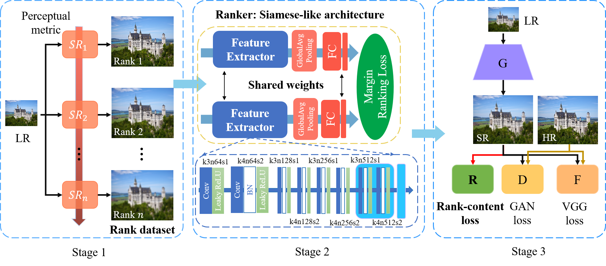
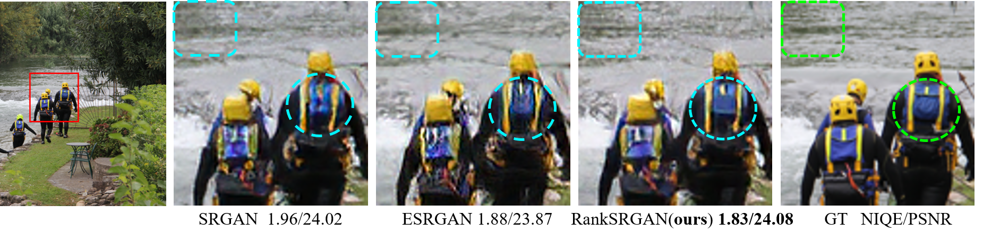

# RankSRGAN 
### [Paper](https://arxiv.org/abs/1908.06382) | [Supplementary file](https://arxiv.org/abs/1908.06382) | [Project Page](https://wenlongzhang0724.github.io/Projects/RankSRGAN)
### RankSRGAN: Generative Adversarial Networks with Ranker for Image Super-Resolution

 By [Wenlong Zhang](https://wenlongzhang0724.github.io/), [Yihao Liu](http://xpixel.group/2010/03/29/yihaoliu.html), [Chao Dong](https://scholar.google.com.hk/citations?user=OSDCB0UAAAAJ&hl=en), [Yu Qiao](http://mmlab.siat.ac.cn/yuqiao/)


---


<p align="center">
  
</p>

<p align="center">
  
</p>

### Dependencies

- Python 3 (Recommend to use [Anaconda](https://www.anaconda.com/download/#linux))
- [PyTorch >= 1.0.0](https://pytorch.org/)
- NVIDIA GPU + [CUDA](https://developer.nvidia.com/cuda-downloads)
- Python packages: `pip install numpy opencv-python lmdb`
- [option] Python packages: [`pip install tensorboardX`](https://github.com/lanpa/tensorboardX), for visualizing curves.

# Codes 
- We update the codes version based on [mmsr](https://github.com/open-mmlab/mmsr). 
The old version can be downloaded from [Google Drive](https://drive.google.com/drive/folders/13ZOwv0HIa_hrtnYAOM9cTzA-AVKqiF8c?usp=sharing)
- This version is under testing. We will provide more details of RankSRGAN in near future.
## How to Test 
1. Clone this github repo. 
```
git clone https://github.com/WenlongZhang0724/RankSRGAN.git
cd RankSRGAN
```
2. Place your own **low-resolution images** in `./LR` folder.
3. Download pretrained models from [Google Drive](https://drive.google.com/drive/folders/1_KhEc_zBRW7iLeEJITU3i923DC6wv51T?usp=sharing). Place the models in `./experiments/pretrained_models/`. We provide three Ranker models and three RankSRGAN models  (see [model list](experiments/pretrained_models)).
4. Run test. We provide RankSRGAN (NIQE, Ma, PI) model and you can config in the `test.py`.
```
python test.py -opt options/test/test_RankSRGAN.yml
```
5. The results are in `./results` folder.

## How to Train
### Train Ranker
1. Download [DIV2K](https://data.vision.ee.ethz.ch/cvl/DIV2K/) and [Flickr2K](https://github.com/LimBee/NTIRE2017) from [Google Drive](https://drive.google.com/drive/folders/1B-uaxvV9qeuQ-t7MFiN1oEdA6dKnj2vW?usp=sharing) or [Baidu Drive](https://pan.baidu.com/s/1CFIML6KfQVYGZSNFrhMXmA)
2. Generate rank dataset [./datasets/generate_rankdataset/](datasets/generate_rankdataset)
3. Run command:
```c++
python train_rank.py -opt options/train/train_Ranker.yml
```

### Train RankSRGAN
We use a PSNR-oriented pretrained SR model to initialize the parameters for better quality.

1. Prepare datasets, usually the DIV2K dataset. 
2. Prerapre the PSNR-oriented pretrained model. You can use the `mmsr_SRResNet_pretrain.pth` as the pretrained model that can be downloaded from [Google Drive](https://drive.google.com/drive/folders/1_KhEc_zBRW7iLeEJITU3i923DC6wv51T?usp=sharing). 
3. Modify the configuration file  `options/train/train_RankSRGAN.json`
4. Run command: 
```c++
python train.py -opt options/train/train_RankSRGAN.yml
```
or

```c++
python train_niqe.py -opt options/train/train_RankSRGAN.yml
```
Using the train.py can output the convergence curves with PSNR; Using the train_niqe.py can output the convergence curves with NIQE and PSNR.

## Acknowledgement
- Part of this codes was done by [Yihao Liu](http://xpixel.group/2010/03/29/yihaoliu.html).
- This codes are based on [BasicSR](https://github.com/xinntao/BasicSR).
